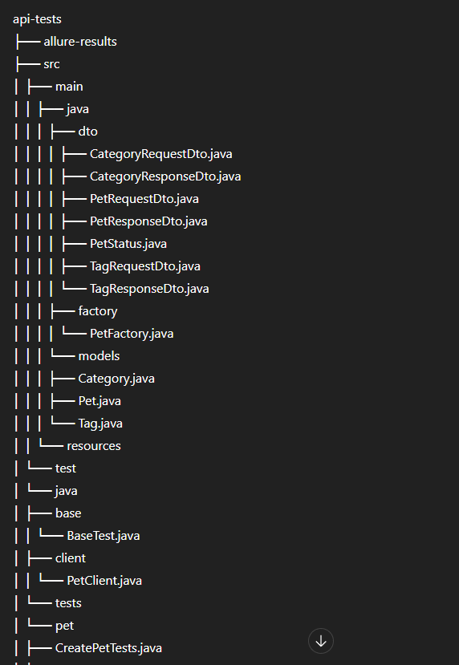

# 📌 Petstore API Test Automation

This project contains automated API tests for **Petstore Swagger API**, covering CRUD operations with both **positive and negative test scenarios**.

The tests are written in **Java 17** using:

- Rest Assured
- JUnit 5
- Allure Reporting
- Jackson (JSON Mapping)
- JSON Schema Validation
- WireMock (for mocking)
- Log4j (logging)

---

## 🌐 API Under Test

🔗 https://petstore.swagger.io/

Tested endpoints include typical CRUD operations such as:

- `POST` – Create resource
- `GET` – Read resource
- `PUT` – Update resource
- `DELETE` – Delete resource

---

# 🧪 Test Coverage

## ✅ Positive Tests
- Create pet with valid payload
- Retrieve pet by valid ID
- Update pet with valid data
- Delete pet successfully
- Validate response schema
- Validate status codes and response body fields

## ❌ Negative Tests
- Create pet with invalid/missing fields
- Retrieve non-existing pet
- Update with invalid ID
- Delete non-existing resource
- Invalid request body validation
- Schema mismatch scenarios

---

# 🛠 Tech Stack

| Technology | Version |
|------------|----------|
| Java | 17 |
| Rest Assured | 5.4.0 |
| JUnit | 5.10.2 |
| Allure | 2.27.0 |
| Jackson | 2.16.0 |
| JSON Schema Validator | 5.5.0 |
| WireMock | 2.35.0 |
| Log4j | 2.24.3 |

---

# 📂 Project Structure

---

# ▶️ How to Run Tests

### Run All Tests
mvn clean test