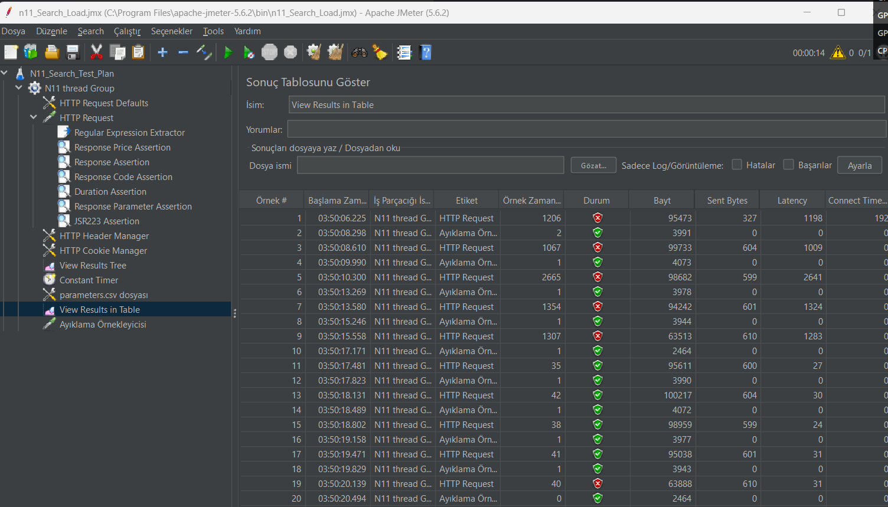
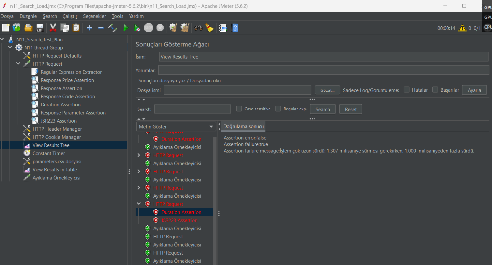

## 📌 N11 Search Load Test – Automation Project
## 1. Objective

This project contains performance and validation (assertion) tests for the N11 Search functionality.

The main goals are:

* Validate Search endpoint behavior under load

* Verify response times

* Validate HTTP status codes

* Verify response content correctness

* Detect functional and performance failures

## 2. Scope

The scope of this test includes:

* Search endpoint request validation

* Response structure validation

* Performance threshold validation

* Error rate monitoring

Out of Scope:

* UI validation

* Database validation

* End-to-end checkout flow
## 3. Technologies Used

* Apache JMeter

* CSV Data Set Config

* Regular Expression Extractor

* Response Assertions

* Duration Assertion

* Response Code Assertion

* JSR223 Assertion (if applicable)

## 4. Test Scenario – Search
   🎯 Scenario Description

A user performs a product search on N11.

Example request:
GET /arama?q=laptop

The system must:

* Return HTTP 200

* Return non-empty response body

* Return a valid product list

* Respond within defined performance threshold

## 5. Test Case Documentation

🔎 TC-SEARCH-001 – Verify HTTP Status Code

   | Field             | Description                          |
   | ----------------- | ------------------------------------ |
   | Test Case ID      | TC-SEARCH-001                        |
   | Description       | Search endpoint must return HTTP 200 |
   | Request           | GET /arama?q={keyword}               |
   | Expected Result   | HTTP 200                             |
   | Validation Method | Response Code Assertion              |

🔎 TC-SEARCH-002 – Validate Response Time

| Field             | Description                           |
| ----------------- |---------------------------------------|
| Test Case ID      | TC-SEARCH-002                         |
| Description       | Response time must be below threshold |
| Expected Result   | < 1000 ms                             |
| Validation Method | Duration Assertion                    |

🔎 TC-SEARCH-003 – Validate Non-Empty Response Body

| Field             | Description                     |
| ----------------- | ------------------------------- |
| Test Case ID      | TC-SEARCH-003                   |
| Description       | Response body must not be empty |
| Expected Result   | Response body length > 0        |
| Validation Method | Response Assertion              |

🔎 TC-SEARCH-004 – Validate Search Result Content

| Field             | Description                                                  |
| ----------------- | ------------------------------------------------------------ |
| Test Case ID      | TC-SEARCH-004                                                |
| Description       | Response must contain product list data                      |
| Expected Result   | Response contains product list element (e.g., "productList") |
| Validation Method | Response Assertion / Regex Extractor                         |

🔎 TC-SEARCH-005 – Invalid Keyword Scenario

| Field             | Description                                      |
| ----------------- | ------------------------------------------------ |
| Test Case ID      | TC-SEARCH-005                                    |
| Description       | System should handle invalid keywords gracefully |
| Input             | q=@@@###                                         |
| Expected Result   | HTTP 200 + Empty result or proper message        |
| Validation Method | Response Code + Content Assertion                |

## 6. Load Configuration

| Parameter                   | Value    |
| --------------------------- | -------- |
| Thread Count                | 1        |
| Ramp-Up Time                | 1 second |
| Loop Count                  | 10       |
| Same User on Each Iteration | Enabled  |

#### Note: These values can be adjusted depending on test type (Smoke, Load, Stress)

## 7. Test Data

| keyword    |
|------------|
| tablet     |
| televizyon |
| araba      |
| oyuncak    |
| frsadgnjsdfgmasm    |

## 8. Execution Steps 
1. Open Apache JMeter

2. Load N11_Search_TestPlan.jmx

3. Verify parameters.csv path

4. Adjust thread settings if necessary

5. Start the test

6. Review results via:
* View Results Tree
* Summary Report
* Aggregate Report

## 9. Assertion Strategy

The following assertion types are used:

* Response Code Assertion → HTTP validation

* Duration Assertion → Performance validation

* Response Assertion → Response body validation

* Regular Expression Extractor → Dynamic value extraction

* JSR223 Assertion → Script-based validation logic

