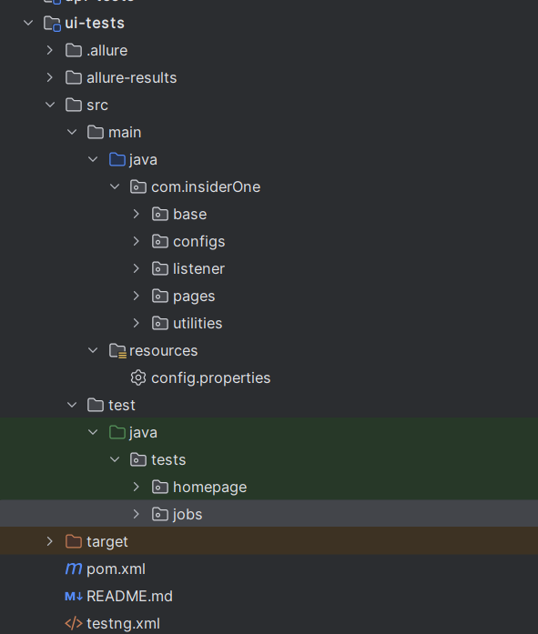
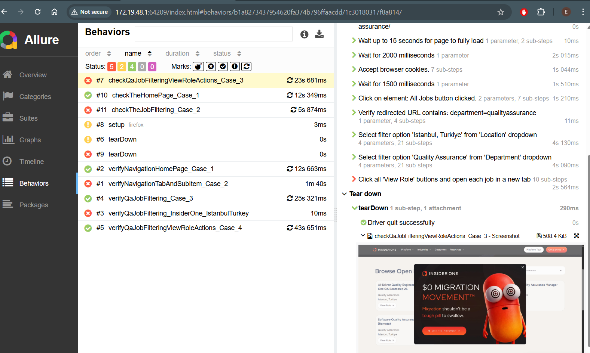

# Insider One UI Test Automation

This project is developed for UI test automation of the Insider One website. The tests first verify the elements on the homepage, then filter QA career job listings for Istanbul, Turkey, and assert the filtered results. Finally, the "View" button is used to open job detail pages.

---

## Technologies & Libraries

| Technology / Library          | Version      |
|------------------------------|--------------|
| Java                         | 17           |
| Selenium Java                | 4.27.0       |
| TestNG                       | 7.10.2       |
| Allure TestNG                | 2.29.0       |
| Lombok                       | 1.18.30      |
| Log4j (API, Core, SLF4J)    | 2.19.0       |
| AspectJ Weaver               | 1.9.22.1     |
| Jackson Databind / XML / YAML| 2.15.2       |
| Owner                        | 1.0.12       |
| JetBrains Annotations        | 24.1.0       |
| SLF4J Simple                 | 2.0.16       |

---

## Project Overview

- **Homepage**: Verification of key UI elements on the homepage.
- **QA Careers Page**: Filtering QA job listings by Istanbul, Turkey location.
- **Job Details**: Opening job detail pages via the "View" button.
- Tests include both positive and negative scenarios.
- Test reports are generated with **Allure**.

---

## Project Structure (Example)


---

## How to Run Tests

### Run all tests with Maven:

```bash
  mvn clean test

```

## Generate Allure Report:
```bash
  mvn allure:serve
```


## Contact
For any questions or contributions, please contact
